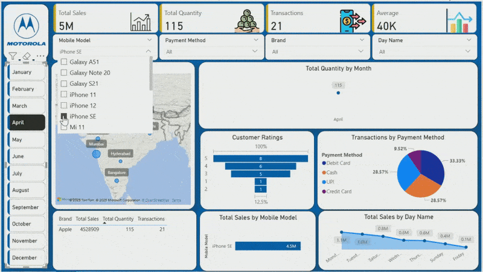

# 📊 Mobile Sales Dashboard using Power BI

This interactive Power BI report presents a detailed analysis of mobile phone sales across various Indian cities.  
It is designed to deliver key business insights from large datasets in a visual and actionable format.

## 🔍 Key Features

- ✅ **KPI Cards**:
  - Total Sales, Quantity Sold, Total Transactions, Average per Transaction
- 🗺️ **Map View**:
  - Total Sales by City plotted on India map
- 📅 **Slicers for Filtering**:
  - Filter by Month, Brand, Payment Method, Day Name, Mobile Model
- 📊 **Visualizations**:
  - Bar Chart: Customer Ratings
  - Pie Chart: Transactions by Payment Method
  - Line Chart: Daily Sales Trend
  - Matrix: Brand-wise performance

## 📁 Files Included

- `Mobile_Sales_Dashboard.pbix` → Power BI report file
- `demo.gif` → Dashboard preview animation (shown above)

## 🛠️ Tools & Skills Used

- **Power BI Desktop**
- **DAX** for custom measures and KPIs
- **Data Modeling** (relationships and hierarchy)
- **Interactive Visualizations & Filtering**

## 📈 Use Case

This dashboard can help business stakeholders:
- Monitor mobile sales by city and brand
- Understand customer preferences
- Track payment trends (e.g. UPI vs Cash vs Cards)
- Optimize sales strategy based on ratings and time patterns

## 🧑‍💻 Amit Kumar Gupta  

---

> ⭐ Don't forget to Star this repo if you like the project!
